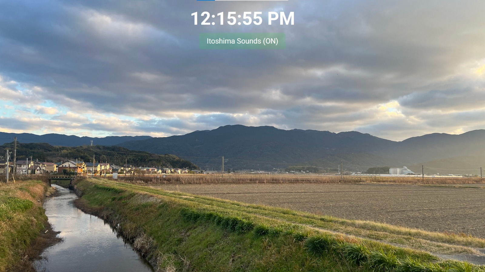

# Itoshima Sounds



## Overview

While staying in Itoshima, Japan, I was deeply inspired by the rural landscapes, the farm life, and the rhythmic sounds of the countryside. The first time, it was a pleasant surprise to hear the music played in the farms at 7 AM, 12 PM, and 5 PM. Over time, these sounds became a comforting presence, marking the rhythm of daily life.

## Purpose of This Project

This HTML page is a tribute to that experience. It automatically plays farm sounds at the designated hours, recreating the atmosphere of working and living in Itoshima.

## How It Works Now (Scalable Config)

The app keeps the same interface, but now behavior is configured from files:

- `config/itoshima.config.yaml` (default, preferred)
- `config/itoshima.config.json` (fallback)

You can add more audio files and images without touching JavaScript:

- Put audio files in `audio/`
- Put image files in `img/`
- Add them in the config file (`audio.schedule`, `audio.manualKeys`, `images.files`)

### Config Example

```yaml
audio:
  schedule:
    - time: "07:00:00"
      file: "audio/1_Studio-Kura-7.mp3"
  manualKeys:
    "1": "audio/1_Studio-Kura-7.mp3"
images:
  files:
    - "img/001.jpg"
```

## Usage

1. Open `index.html` in a browser.
2. Click `Itoshima Sounds (OFF)` to switch ON.
3. Keep tab open in background.
4. Sounds will play at configured times.

Manual keys are also configurable (`1`, `2`, `3`, etc.) via `audio.manualKeys`.

## GitHub Pages Deployment (GitHub Actions)

This repository now includes:

- `.github/workflows/pages.yml`

To publish:

1. Push to `main`.
2. In GitHub: `Settings -> Pages`.
3. Set `Source` to `GitHub Actions`.
4. Wait for workflow `Deploy Static Site to GitHub Pages` to complete.

## Thanks

Music soundtrack recordings by Oda at Studio Kura, Jan 2025.

## References

- https://studiokura.info/en/
- https://en.wikipedia.org/wiki/Itoshima,_Fukuoka


