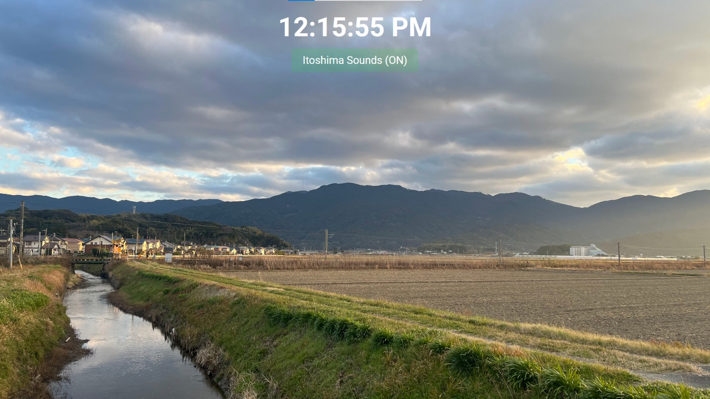

# Itoshima Sounds

## Overview

While staying in Itoshima, Japan, I was deeply inspired by the rural landscapes, the farm life, and the rhythmic sounds of the countryside. The first time, it was a pleasant surprise to hear the music played in the farms at 7 AM, 12 PM, and 5 PM. Over time, these sounds became a comforting presence, marking the rhythm of daily life—signaling the start of work, lunch breaks, and the return home to family. This auditory tradition became an integral part of my experience, shaping the way I perceived time and work within this serene setting

## Purpose of This Project

This simple HTML page is a tribute to that experience. It is designed to automatically play those farm sounds at the designated hours, recreating the immersive atmosphere of working and living in Itoshima. The idea is to let this play in the background in a browser tab, evoking the nostalgia of those moments while blending seamlessly into everyday life.

## Future Improvements

This project has room to grow, with possible enhancements such as:

Adding more images or video footage of the Itoshima countryside.

Introducing random ambient sounds—cars, wind, birds, and natural noises—to create a more immersive experience.

Incorporating varied soundtracks that reflect different seasons and weather conditions.

Implementing random animated sequences that overlay the images, enhancing the visual experience.

## How to Use

Download and extract this zip file that contains all the project:  

<a id="raw-url" href="https://github.com/vlasvlasvlas/itoshima_sound/raw/refs/heads/main/itoshima_sound.zip">ITOSHIMA SOUNDS ZIP FILE</a>

Or you can download this repo.

Then, simply open the HTML file in your browser, and turon ON the Itoshima sounds button.

Then, let it run in the background. 

At 7 AM, 12 PM, and 5 PM, the corresponding music will play, just like it does in the fields of Itoshima.

This is a small homage to the beauty of rural Japan and the gentle rhythms that shape life on the farms. I hope it brings a sense of calm and connection to those who experience it.

## Thanks

Music soundtrack recordings by Oda at Studio Kura, Jan 2025.

## References

https://studiokura.info/en/

https://en.wikipedia.org/wiki/Itoshima,_Fukuoka

